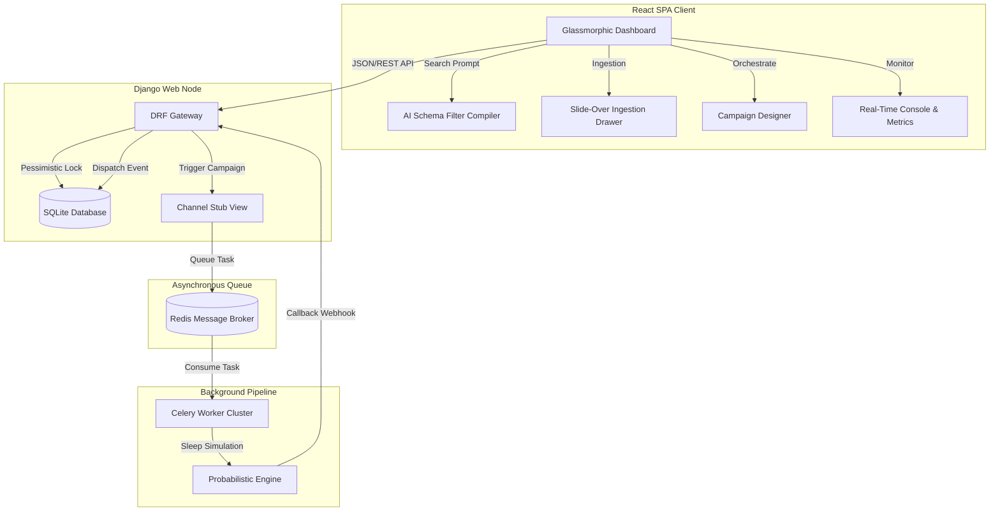

# Xeno Mini-CRM: High-Performance Enterprise Customer Engagement Engine

A production-grade, highly scalable Mini-CRM application built using a split-component architecture: **Django REST Framework (Backend)** and **React (Frontend)**. The system includes an integrated asynchronous message delivery simulation engine using **Celery & Redis**, a natural language query compiler (AI Schema Filter), and a high-fidelity dark-themed dashboard.

---

## 🏗️ System Architecture & Data Flow

The platform is divided into three logical layers to ensure decoupling, reliability, and high concurrency:



### 1. Ingestion & Database Sync Layer
* **Single / Bulk Loaders**: Ingestion is processed atomic-transaction-style. The UI sends single profiles, transactions, or raw bulk JSON matrices.
* **Pessimistic Row-Level Locking**: Webhook callbacks use `select_for_update()` to prevent race conditions during concurrent delivery logs status updates.

### 2. Campaign Orchestration Engine
* **Fat Model Architecture**: Segment validation is contained inside the `Campaign` model, evaluating arbitrary JSON-based filter queries directly against custom database querysets.
* **Outbound Webhooks**: Once a campaign runs, messages are generated for all matched contacts. The Django system dispatches them immediately to the carrier service, using transaction hooks (`transaction.on_commit`) to verify logs are saved before triggering network calls.

### 3. Simulation & Webhook Worker
* **Carrier Stub**: A standalone app (`channel_stub`) representing an external SMS/WhatsApp/Email gateway.
* **Asynchronous Task Queueing**: Queues delivery tasks on a Celery worker.
* **Probabilistic Delivery Simulator**: Simulates delivery latency (2 seconds) and resolves status using a random distribution (75% Delivered, 15% Read, 10% Failed) before notifying the CRM via webhook callback.

---

## 🗄️ Relational Database Schema

The database model structure is designed with indexes for rapid retrieval:

### 1. `Shopper`
Represents a customer profile in the CRM database.
* `id` (`UUID`, Primary Key, auto-generated)
* `first_name` (`CharField(100)`)
* `last_name` (`CharField(100)`)
* `email` (`EmailField(254)`, Unique, Indexed)
* `phone` (`CharField(20)`)
* `city` (`CharField(100)`, Indexed)
* **Custom QuerySet Aggregates**:
  - `calculated_spend`: Aggregates the sum of all associated order amounts.
  - `calculated_orders`: Counts the number of order records.
  - Filter methods: `by_monetary_spend()`, `by_purchase_frequency()`, `by_location()`, `by_recency()`.

### 2. `Order`
Represents purchase transactions completed by customers.
* `id` (`UUID`, Primary Key)
* `shopper` (`ForeignKey` -> `Shopper`, Cascade)
* `amount` (`DecimalField(12, 2)`)
* `purchase_date` (`DateTimeField`, Indexed)

### 3. `Campaign`
Outreach campaigns targeting customer segments.
* `id` (`UUID`, Primary Key)
* `name` (`CharField(255)`)
* `segment_rules` (`JSONField`): Arbitrary segment keys (`min_spend`, `min_orders`, `city`, `max_inactive_days`).
* `message_template` (`TextField`): Message copy containing placeholders: `[first_name]`, `[last_name]`, `[city]`, `[email]`.
* `status` (`CharField(20)`): Choices are `PENDING`, `RUNNING`, `COMPLETED`, `FAILED`.

### 4. `DeliveryLog`
Audits delivery states for each recipient in a campaign.
* `id` (`UUID`, Primary Key)
* `campaign` (`ForeignKey` -> `Campaign`, Cascade)
* `shopper` (`ForeignKey` -> `Shopper`, Cascade)
* `status` (`CharField(20)`): Choices are `PENDING`, `DELIVERED`, `READ`, `FAILED`.
* `message_content` (`TextField`)
* `sent_at` (`DateTimeField`, Nullable)
* **Constraint**: `unique_campaign_shopper_delivery` prevents duplicate campaign dispatches.

---

## 🔌 API Endpoints Reference

The backend API is served under the `/api/` prefix.

### Core CRM Endpoints

| Endpoint | Method | Payload | Description |
| :--- | :--- | :--- | :--- |
| `/api/health/` | `GET` | None | Returns backend status and timestamp. |
| `/api/shoppers/` | `GET` | None | Lists all shoppers. |
| `/api/shoppers/` | `POST` | `Shopper JSON` | Registers a single shopper. |
| `/api/shoppers/bulk_ingest/` | `POST` | `Array of Shoppers` | Performs bulk update-or-create operations inside an atomic block. |
| `/api/orders/` | `GET` | None | Lists all order transactions. |
| `/api/orders/` | `POST` | `Order JSON` | Registers an order. Links to shopper via `shopper_email`. |
| `/api/orders/bulk_ingest/` | `POST` | `Array of Orders` | Performs bulk order ingestion. |
| `/api/campaigns/` | `GET` | None | Lists all campaigns. |
| `/api/campaigns/` | `POST` | `Campaign JSON` | Creates a campaign. |
| `/api/campaigns/estimate_segment/` | `POST` | `Rules JSON` | Predicts matching shoppers count without saving. |
| `/api/campaigns/<id>/send/` | `POST` | None | Evaluates segment, makes delivery logs, and triggers asynchronous sends. |
| `/api/campaigns/<id>/stats/` | `GET` | None | Returns detailed delivery success and conversion rates. |
| `/api/campaigns/nlp_segment/` | `POST` | `{"query": "string"}` | Compiles natural language (Hinglish/English) into database filters. |
| `/api/campaigns/generate_copy/` | `POST` | `Copy Context JSON` | Generates copy variations (VIP, Corporate, Hinglish) using OpenAI or copywriting fallbacks. |
| `/api/delivery-logs/` | `GET` | Query `campaign_id` | Lists delivery histories. |
| `/api/delivery-logs/webhook/` | `POST` | `{"delivery_log_id": "", "status": ""}` | Ingests carrier callbacks with pessimistic row locking. |

### Channel Stub Endpoints

| Endpoint | Method | Payload | Description |
| :--- | :--- | :--- | :--- |
| `/api/channel-stub/send/` | `POST` | `{"delivery_log_id", "shopper_id", "message_content"}` | Entry gateway queueing Celery tasks. |

---

## 🎨 Aesthetic Frontend Workspace (Tabs)

The React UI is styled using custom dark-themed components, glassmorphic overlays, and typewriter effects:

### Tab 1: Live Audiences (Data-First Ingestion Canvas)
* **Natural Language Compiler Search Bar**: An interactive search input featuring an animated typewriter placeholder that suggests query patterns. 
* **Full-Width Viewport Table**: High-density grid rendering customer metrics (spend, order count, coordinates).
* **Slide-Over Side-Sheet Drawer**: Clicking `➕ Add Shopper`, `💸 Log Order`, or `📥 Bulk Ingest` launches a side drawer (`w-[420px] bg-[#0F1322]/90 backdrop-blur-xl border-l border-white/0.05`). A backdrop overlay handles clicks to dismiss the drawer.

### Tab 2: Campaign Orchestrator
* **Channel Selection**: Configure campaign routes (WhatsApp, SMS, Email, RCS).
* **AI Copywriter**: Generates creative copy suggestions using OpenAI API keys or rule-based generators.
* **Placeholders**: Template compiler updates variables like `[first_name]` in real-time.

### Tab 3: Telemetry Insights
* **Metric Cards**: Dashboard tracking Dispatched count, Delivery success rate, Pending queues, and Revenue generated.
* **Animated Graph**: Real-time canvas rendering system load.
* **Operational Log Console**: A scrolling terminal console logs API interactions, Celery worker actions, database transaction commits, and webhook triggers.

---

## ⚙️ Development Setup & Execution Instructions

Follow these instructions to start the application components locally:

### Prerequisites
* Python 3.10+
* Node.js 16+
* Redis Server (running on `localhost:6379`)

---

### Step 1: Start Redis
Make sure Redis is active. If using Docker, launch the broker with:
```bash
docker run -d -p 6379:6379 redis:alpine
```

---

### Step 2: Configure & Run Django Backend (Terminal 1)

1. Navigate to the backend directory:
   ```powershell
   cd backend
   ```
2. Create and activate a virtual environment:
   ```powershell
   python -m venv venv
   # On Windows (PowerShell):
   .\venv\Scripts\Activate.ps1
   # On Linux / macOS:
   source venv/bin/activate
   ```
3. Install dependencies:
   ```bash
   pip install -r requirements.txt
   ```
4. Create a `.env` file in the `backend/` directory to configure environment variables (optional):
   ```env
   OPENAI_API_KEY=your-openai-api-key
   DJANGO_DEBUG=True
   CELERY_BROKER_URL=redis://localhost:6379/0
   CELERY_RESULT_BACKEND=redis://localhost:6379/0
   ```
5. Apply database migrations:
   ```bash
   python manage.py makemigrations crm_app channel_stub
   python manage.py migrate
   ```
6. Start the Django development server:
   ```bash
   python manage.py runserver
   ```
   The backend server will run at `http://127.0.0.1:8000/`.

---

### Step 3: Run the Celery Worker (Terminal 2)

Open a new terminal, activate your virtual environment, and start the worker:
```powershell
cd backend
# Activate virtual environment
.\venv\Scripts\Activate.ps1
# Launch Celery worker
celery -A core_crm worker --loglevel=info
```

---

### Step 4: Configure & Run React Frontend (Terminal 3)

1. Navigate to the frontend directory:
   ```bash
   cd frontend
   ```
2. Install npm dependencies:
   ```bash
   npm install
   ```
3. Create a `.env` file in the `frontend/` directory (optional):
   ```env
   REACT_APP_API_URL=http://localhost:8000/api
   ```
4. Start the development server:
   ```bash
   npm start
   ```
   The React dashboard will open automatically in your browser at `http://localhost:3000/`.

---

## 🛠️ Verification & Troubleshooting

### System Health Audits
* If the backend returns `ModuleNotFoundError: No module named 'core_crm.wsgi'`, verify that both `wsgi.py` and `asgi.py` are present in `backend/core_crm/` and correctly point to `core_crm.settings`.
* Make sure `npm start` doesn't throw a parsing syntax error. The JSX components in `frontend/src/App.js` use clean tag closures and responsive layouts.
* Use the health endpoint (`http://localhost:8000/api/health/`) to check if the backend API is up and running.
* View live console messages inside **Tab 3: Telemetry Insights** to audit callback signatures and row lock actions.
